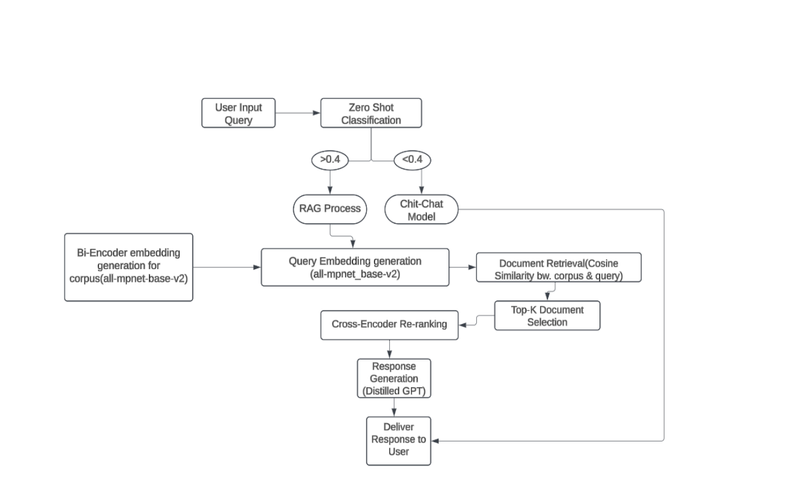
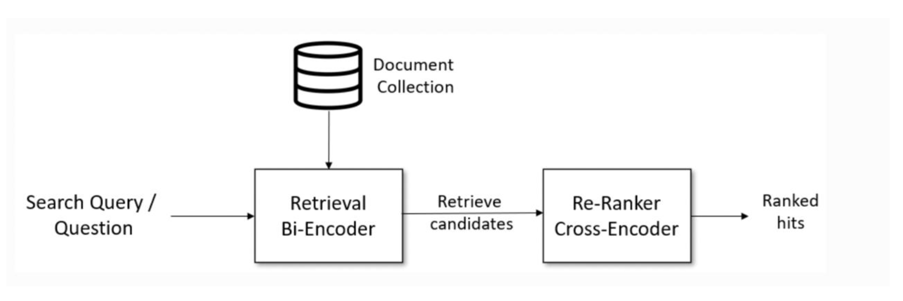
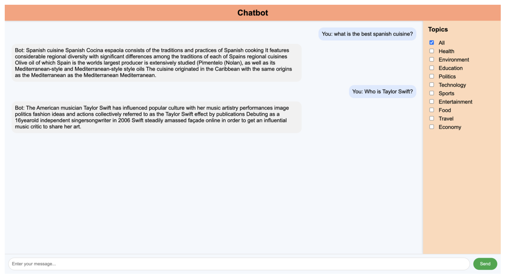

# IntelliBot Framework: A Conversational AI Chatbot Powered by NLP

## Overview
**IntelliBot Framework** is a multi-functional, AI-powered chatbot designed to handle both general conversations and topic-specific discussions with contextual accuracy. Built with cutting-edge **Natural Language Processing (NLP)** techniques, the chatbot integrates advanced **Retrieval-Augmented Generation (RAG)** pipelines and **zero-shot classification** models to provide meaningful, engaging, and accurate responses.

The chatbot was trained on a diverse dataset of **50,000 Wikipedia documents** covering topics like Health, Technology, Education, and more. Its capabilities include multi-turn conversations, topic-aware dialogue switching, and real-time performance analytics.

---

## Features
- **Multi-Topic Support:** Covers 10 diverse domains, dynamically switching between topics.
- **General Chat Support:** Robust fallback conversational module using **DialoGPT** for seamless, natural conversations.
- **Knowledge Base:** Equipped with 50,000 Wikipedia articles, ensuring accurate and well-informed responses.
- **RAG Pipeline Integration:** Combines document retrieval and response generation for precise, topic-specific replies.
- **Real-Time Analytics:** Tracks user interactions, error rates, and performance metrics via a visualization dashboard.
- **Cloud Deployment:** Hosted on **Google Cloud Platform (GCP)** for scalability and accessibility.

---

## Architecture

 

1. **Topic Classification:**
   - Uses `facebook/bart-large-mnli` for zero-shot topic classification.
   - Dynamically switches between topic-specific responses and chit-chat based on confidence thresholds.

2. **RAG Pipeline:**
   - Employs `SentenceTransformer` for embedding-based document retrieval.
   - Cross-encoder re-ranking ensures the most relevant documents are selected.
   - Generative model (`DistilGPT`) synthesizes concise, contextually appropriate responses.

3. **Chit-Chat Module:**
   - Powered by fine-tuned `DialoGPT-medium` for general conversations.
   - Supports multi-turn, natural dialogue flow.

---

## Visualizations
The chatbot includes an analytics dashboard with the following insights:
- **User Interaction Patterns:** Tracks engagement trends over time.
- **Response Distribution:** Visualizes the topics and types of responses handled by the chatbot.
- **Error Metrics:** Identifies areas for improvement by analyzing error rates per topic.
- **Session Metrics:** Monitors average session length, retrieved documents, and overall system performance.

---
